# BaseByFelice - WhatsApp Bot

<div align="center">


[](https://nodejs.org/en/download/)
[](https://whatsapp.com/6285624763201)
[](https://github.com/FeliciaLonely)
[](https://github.com/FeliciaLonely/BaseByFelice/stargazers)
[](https://github.com/FeliciaLonely/BaseByFelice/network/members)
[](https://github.com/FeliciaLonely/BaseByFelice/issues)
[](https://github.com/FeliciaLonely/BaseByFelice/blob/main/LICENSE)

Base WhatsApp Bot simple dengan Case & Plugin System

Dibuat dengan ❤️ oleh SkyWalker

### Contributors
- **Felicia** (Pembuat)
- **SkyWalker** (Support Project)

</div>

---

## Overview

BaseByFelice adalah base WhatsApp Bot yang simple, powerful, dan mudah dikustomisasi. Dibangun dengan Baileys library terbaru dan menggunakan Case & Plugin System yang fleksibel untuk pengembangan fitur yang lebih terstruktur.

### Mengapa Pilih Base Bot BaseByFelice?

<div align="center">

| 🚀 Simple | 🔧 Flexible | 📱 Stable | 🎨 Customizable |
|-----------|-------------|-----------|----------------|
| Built dengan penyesuaian terbaru | Case & Plugin system | Connection yang stabil | Easy customization |

</div>

---

## 💫 Features

<div align="center">

### 🎯 Core Features

```mermaid
graph TD
    A[🤖 BaseByFelice] --> B[📝 Case System]
    A --> C[🔌 Plugin System]
    A --> D[💾 Multi-Session]
    A --> E[📊 Auto Reconnect]
    
    B --> B1[📂 Organized Commands]
    B --> B2[🔄 Easy Management]
    
    C --> C1[🧩 Modular Design]
    C --> C2[🎨 Custom Plugins]
    
    D --> D1[🔐 Secure Auth]
    D --> D2[💿 Persistent Storage]
    
    E --> E1[🌐 Connection Monitor]
    E --> E2[⚡ Auto Recovery]
```

</div>


### Technical Features

- **Baileys Latest Version** - Always up-to-date dengan WhatsApp Web API terbaru
- **Multi-Device Support** - Support untuk WhatsApp Multi-Device
- **Pairing Code Authentication** - Login dengan kode pairing yang mudah
- **Persistent Sessions** - Session tersimpan otomatis
- **Auto Reconnection** - Koneksi otomatis pulih saat terputus
- **Rich Media Support** - Support gambar, video, audio, stiker, dan dokumen
- **Message Handling** - Sistem handling pesan yang robust
- **Easy Configuration** - Konfigurasi yang mudah dan fleksible

### Bot Features

- **Auto Reply** - Balasan otomatis untuk pesan tertentu
- **Media Downloader** - Download dari berbagai platform
- **Sticker Maker** - Pembuat stiker dari gambar/video
- **Web Scraping** - Tools untuk scraping web
- **Fun Commands** - Game dan hiburan
- **Group Management** - Manajemen grup WhatsApp
- **Analytics** - Statistik penggunaan bot
- **Admin Controls** - Kontrol khusus untuk admin

---

## Installation

### Requirements

Pastikan kamu sudah menginstall:
- **Node.js** (Disarankan!! Menggunakan Node.js v18.0.0 atau lebih baru)
- **Git**
- **NPM atau Yarn**
- **PM2**

### Quick Start

```bash
# 1️⃣ Clone repository
git clone https://github.com/FeliciaLonely/BaseByFelice.git
cd BaseByFelice

# 2️⃣ Install dependencies
npm install
# atau menggunakan yarn
yarn install

# 3️⃣ Setup configuration
cp config/settings.example.js config/settings.js
# Edit config/settings.js sesuai kebutuhan

# 4️⃣ Run the bot
npm start
# atau
node index.js
```

### 🔧 Configuration

Edit & Tambahkan Code Di file `config/settings.js`:

```javascript
// Example config/settings.js
global.owner = ['628xxx'] // Nomor owner
global.botname = 'BaseByFelice' // Nama bot
global.ownername = 'Felicia' // Nama owner
global.packname = 'BaseByFelice' // Nama sticker pack
global.author = 'Felicia' // Author sticker
```

---

## Project Structure

```
BaseByFelice/
├── 📁 command/
├── 📁 config/
├── 📁 database/
├── 📁 lib/
├── 📄 case.js
├── 📄 index.js
├── 📄 readme.md
└── 📄 package.json
```

---

## Usage

### Case System

Tambahkan fitur case baru di dalam code case nya sebelum default:

**Example Code:**

```javascript
case 'menu': {
    let botInfo = ``
    vynnoxbeyours.sendMessage(m.chat, {
        image: { url: "urllu" },
        caption: botInfo,
        contextInfo: {
            mentionedJid: [m.sender],
            forwardedNewsletterMessageInfo: {
                newsletterName: "🕸⃟𝐍𝐞͢𝐯𝐚𝐫𝐢𝐚𝐇͢𝐮͠𝐧͢𝐭𝐞𝐫𝐗᷍𝐱𝐱͢͡",
                newsletterJid: `idchlu@newsletter`
            },
            isForwarded: true,
            externalAdReply: {
                showAdAttribution: false,
                renderLargerThumbnail: false,
                gifPlayback: true,
                gifAttribution: 1,
                title: `🕸⃟𝐍𝐞͢𝐯𝐚𝐫𝐢𝐚𝐇͢𝐮͠𝐧͢𝐭𝐞𝐫𝐗᷍𝐱𝐱͢͡`,
                body: `A simple WhatsApp bot uses JavaScript to respond to commands automatically.`,
                mediaType: 1,
                thumbnailUrl: `thumblu`,
                thumbnail: ``,
                sourceUrl: `serahlu`
            }
        }
    }, { quoted: m });
    break;
}

case 'buttonold': {
    let teks = `> ようこそ`;
    const buttons = [
        {
            buttonId: `${prefix}bugmenu`,
            buttonText: { displayText: 'kosong' }
        },
        {
            buttonId: `${prefix}menu`,
            buttonText: { displayText: 'kosong' }
        }
    ];

    const buttonMessage = {
        image: { url: 'https://files.catbox.moe/msoysl.jpg' },
        caption: teks,
        footer: `Nǐ hǎo, nǐ gānggāng shǐyòngle zhǐlìngq ${prefix + command}`,
        buttons: buttons,
        headerType: 1,
        viewOnce: true
    };

    await vynnoxbeyours.sendMessage(m.chat, buttonMessage, { quoted: m });
    break;
}

default:
```

### Plugin System

Buat plugin baru di folder `plugins/`:

```javascript
// plugins/cannieupsw.js
let handler = async (m, { vynnoxbeyours, text, nevreply }) => {
    const quoted = m.quoted ? m.quoted : null;

    if (!quoted && text) {
        vynnoxbeyours.sendStatusMention(
            { text: text },
            [m.chat]
        );
        return;
    }

    if (quoted && quoted.mtype === "conversation") {
        NeXura.sendStatusMention(
            { text: quoted.text || '' },
            [m.chat]
        );
        return;
    }

    if (quoted.mtype === "audioMessage") {
        let audioData = await quoted.download();
        vynnoxbeyours.sendStatusMention(
            { audio: audioData, mimetype: 'audio/mp4', ptt: true },
            [m.chat]
        );
    }

    if (quoted.mtype === "imageMessage") {
        let imageData = await quoted.download();
        vynnoxbeyours.sendStatusMention(
            { image: imageData, caption: text || '' },
            [m.chat]
        );
    }

    if (quoted.mtype === "videoMessage") {
        let videoData = await quoted.download();
        vynnoxbeyours.sendStatusMention(
            { video: videoData, caption: text || '' },
            [m.chat]
        );
    }
};

handler.help = ['upsw'];
handler.tags = ['owner'];
handler.command = ['upsw'];
handler.owner = true;

module.exports = handler
```

### Custom Commands

```javascript
// Contoh command sederhana
case 'sticker':
case 's':
    if (!quoted) return m.reply('Reply gambar/video!')
    let media = await vynnoxbeyours.downloadMediaMessage(quoted)
    let webp = await imageToWebp(media)
    await vynnoxbeyours.sendMessage(m.chat, { sticker: webp }, { quoted: m })
    break
```

---

## Configuration Options

### Global Settings

| Option | Type | Default | Description |
|--------|------|---------|-------------|
| owner | Array | [] | Nomor owner bot |
| botname | String | BaseByFelice | Nama bot |
| prefix | String | ! | Prefix command |
| autoread | Boolean | true | Auto read messages |
| anticall | Boolean | true | Reject incoming calls |

### Bot Settings

| Option | Type | Default | Description |
|--------|------|---------|-------------|
| sessionName | String | session | Nama folder session |
| printQRInTerminal | Boolean | false | Print QR di terminal |
| usePairingCode | Boolean | true | Gunakan pairing code |
| browser | Array | ["Ubuntu", "Chrome", "20.0.04"] | Browser info |

---

## Advanced (Opsional)

### Auto Restart

Tambahkan PM2 untuk auto restart:

```bash
# Install PM2
npm install -g pm2

# Start dengan PM2
pm2 start index.js --name "BaseByFelice"

# Monitor
pm2 monit

# Logs
pm2 logs BaseByFelice
```

### Docker Support

```dockerfile
FROM node:18-alpine

WORKDIR /app
COPY package*.json ./
RUN npm install
COPY . .

EXPOSE 3000
CMD ["npm", "start"]
```

```bash
# Build image
docker build -t basebyfelice .

# Run container
docker run -d --name whatsapp-bot basebyfelice
```

---

## 🤝 Contributing

Kami menyambut kontribusi dari semua orang!

### 🌟 How to Contribute

1. 🍴 Fork repository ini
2. 🌿 Create branch baru (`git checkout -b feature/AmazingFeature`)
3. 💻 Commit perubahan (`git commit -m 'Add some AmazingFeature'`)
4. 🚀 Push ke branch (`git push origin feature/AmazingFeature`)
5. 📫 Open Pull Request

### Contribution Guidelines

- Gunakan code style yang konsisten
- Tambahkan dokumentasi untuk fitur baru
- Test fitur sebelum submit PR
- Ikuti conventional commits format

---

## 🐛 Bug Reports & Feature Requests

### 🐞 Found a Bug?

1. Pastikan bug belum dilaporkan di [Issues](https://github.com/FeliciaLonely/BaseByFelice/issues)
2. Buat issue baru dengan template bug report
3. Sertakan informasi lengkap tentang bug

### 💡 Want a Feature?

1. Cek [Issues](https://github.com/FeliciaLonely/BaseByFelice/issues) untuk request serupa
2. Buat issue baru dengan template feature request
3. Jelaskan detail fitur yang diinginkan

---

## Stats

<div align="center">


</div>

---

## 🙏 Acknowledgments

- [Baileys](https://github.com/WhiskeySockets/Baileys) - WhatsApp Web API library
- [Node.js](https://nodejs.org/) - JavaScript runtime
- All Contributors - Yang telah berkontribusi pada project ini

---

## Support & Contact

<div align="center">

[](https://whatsapp.com/6285624763201)
[](https://github.com/FeliciaLonely)

**Butuh bantuan? Jangan ragu untuk menghubungi!**

</div>

---

## License

Distributed under the MIT License. See [LICENSE](LICENSE) for more information.

---

## Star History

<div align="center">

[](https://star-history.com/#FeliciaLonely/BaseByFelice&Date)

</div>

---

## Thanks to

<div align="center">

| Felicia | SkyWalker | WhiskeySockets |
|---------|-----------|----------------|
|  |  |  |

</div>

---

<div align="center">

🎉 **Terima kasih telah menggunakan BaseByFelice!** 🎉

Jika project ini membantu, jangan lupa kasih ⭐ ya!

**Made with ❤️ by Felicia**

© 2025 BaseByFelice. All rights reserved.

</div>
